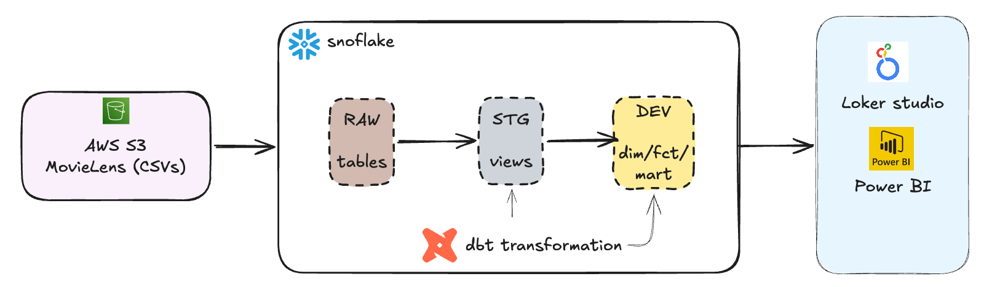
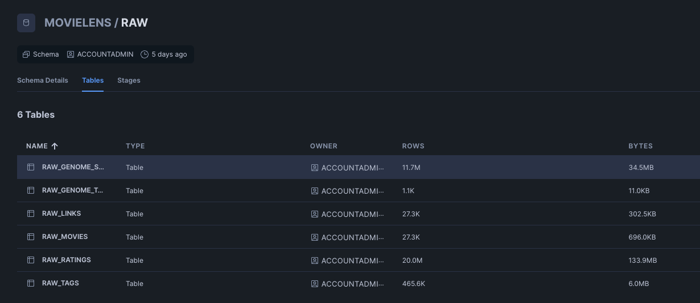

# Netflix Data Transformation with dbt

An end-to-end data pipeline for analyzing the [MovieLens dataset](https://grouplens.org/datasets/movielens/) using dbt and Snowflake. Raw CSV data is ingested from S3 into Snowflake, then transformed through a layered dbt project into dimensional models ready for analysis.

## Architecture



```
S3 Bucket (CSV files)
        │
        ▼
Snowflake RAW schema
(raw_movies, raw_ratings, raw_tags, raw_genome_tags, raw_genome_scores, raw_links)
        │
        ▼
staging layer  (views)   src_movies, src_ratings, src_tags, ...
        │
        ▼
dim / fct layer (tables) dim_movies, dim_users, dim_genome_tags, fct_ratings, fct_genome_scores
        │
        ▼
mart layer      (tables) mart_movie_releases
```

## Dataset

| Source table | Description |
|---|---|
| `raw_movies` | Movie IDs, titles, and pipe-delimited genres |
| `raw_ratings` | User ratings (0.5–5.0) with Unix timestamps |
| `raw_tags` | Free-text tags applied by users to movies |
| `raw_genome_tags` | Curated genome tag vocabulary |
| `raw_genome_scores` | Relevance scores (0–1) linking movies to genome tags |
| `raw_links` | IMDb and TMDb IDs for each movie |



## dbt Models

### Staging (views)
Thin renaming/casting layer directly on top of raw source tables.

- `src_movies` — exposes `movie_id`, `movie_title`, `movie_genres`
- `src_ratings` — exposes `user_id`, `movie_id`, `rating`, `rated_at`
- `src_tags` — exposes `user_id`, `movie_id`, `tag_name`, `tagged_at`
- `src_genome_tags` — exposes `tag_id`, `tag_name`
- `src_genome_scores` — exposes `movie_id`, `tag_id`, `relevance_score`
- `src_links` — exposes `movie_id`, `imdb_id`, `tmdb_id`

### Dimensions (tables)
- `dim_movies` — cleansed movie metadata; title standardized with `INITCAP`, genres split into an array
- `dim_users` — unique users derived from both ratings and tags
- `dim_genome_tags` — genome tag dimension with cleaned tag names

### Facts (tables)
- `fct_ratings` — user–movie rating events; FK-tested against `dim_movies`
- `fct_genome_scores` — movie–tag relevance scores (0–1)

### Marts (tables)
- `mart_movie_releases` — joins ratings with a seed of known release dates to classify movies as `Released` / `Not Released`

### Snapshots
- `snap_tags` — type-2 SCD snapshot of `src_tags` using `dbt_utils.generate_surrogate_key`; tracks tag changes over time by `(user_id, movie_id, tag_name)`

### Analyses
- `movie_analysis.sql` — top-20 highest-rated movies with at least 100 ratings

## Tech Stack

| Tool | Version |
|---|---|
| Python | 3.12 |
| dbt-core | 1.9.0 |
| dbt-snowflake | 1.9.0 |
| dbt-labs/dbt_utils | 1.3.0 |
| Snowflake | `MOVIELENS` database |
| AWS S3 | source data storage |

## Project Structure

```
netflix_dbt/
├── analyses/
│   └── movie_analysis.sql
├── macros/
│   └── no_nulls_in_columns.sql
├── models/
│   ├── staging/
│   │   ├── sources.yml
│   │   ├── src_movies.sql
│   │   ├── src_ratings.sql
│   │   ├── src_tags.sql
│   │   ├── src_genome_tags.sql
│   │   ├── src_genome_scores.sql
│   │   └── src_links.sql
│   ├── dim/
│   │   ├── dim_movies.sql
│   │   ├── dim_users.sql
│   │   └── dim_genome_tags.sql
│   ├── fct/
│   │   ├── fct_ratings.sql
│   │   └── fct_genome_scores.sql
│   ├── mart/
│   │   └── mart_movie_releases.sql
│   └── schema.yml
├── seeds/
│   └── seed_movies_release_dates.csv
├── snapshots/
│   └── snap_tags.sql
├── tests/
│   └── relevance_score_test.sql
├── packages.yml
└── dbt_project.yml
snowflake/
└── s3_to_snowflake_integration.sql
requirements.txt
```

## Setup

### Prerequisites

- Snowflake account with a `MOVIELENS` database and `RAW` schema
- AWS S3 bucket containing the MovieLens CSV files
- Python 3.12

### 1. Install dependencies

```bash
python -m venv .venv
source .venv/bin/activate
pip install -r requirements.txt
```

### 2. Configure environment variables

Create a `.env` file at the project root:

```env
AWS_KEY_ID=your_aws_key_id
AWS_SECRET_KEY=your_aws_secret_key
```

### 3. Load raw data into Snowflake

Run the setup SQL to create the S3 external stage and load all raw tables:

```bash
snowsql -f snowflake/s3_to_snowflake_integration.sql
```

### 4. Configure dbt profile

Add a `netflix_dbt` profile to `~/.dbt/profiles.yml`:

```yaml
netflix_dbt:
  target: dev
  outputs:
    dev:
      type: snowflake
      account: <your_account>
      user: <your_user>
      password: <your_password>
      role: <your_role>
      database: MOVIELENS
      warehouse: COMPUTE_WH
      schema: DBT_DEV
      threads: 4
```

### 5. Run the pipeline

```bash
cd netflix_dbt

dbt deps             # install dbt packages
dbt seed             # load seed files
dbt run              # build all models
dbt test             # run all tests
dbt snapshot         # run snapshots
dbt docs generate && dbt docs serve  # browse lineage docs
```

## Testing

Tests are defined in [netflix_dbt/models/schema.yml](netflix_dbt/models/schema.yml):

- `not_null` on all primary and foreign key columns
- `relationships` — `fct_ratings.movie_id` → `dim_movies.movie_id`
- Custom macro `no_nulls_in_columns` applied to genome score data
- Custom singular test `relevance_score_test.sql` — validates scores are within [0, 1]
